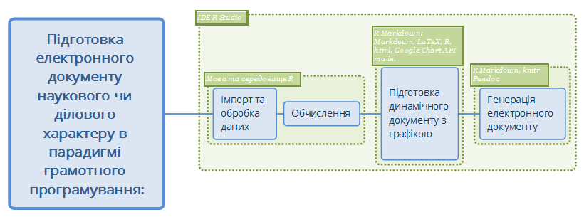
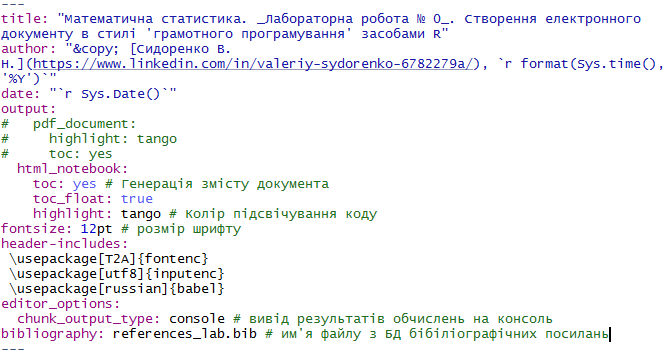

__Мета:__ _quick start для роботи у середовищі RStudio із застосуванням концепції "грамотного програмування" засобами мови програмування R, пакету R Markdown та системи комп'ютерної верстки LaTeX_. 


## Що ви будете вміти?

* Створювати електронний документ (у форматах html, pdf, doc) на кшталт того, __який ви зараз читаєте__ (інтерактивне меню, можливість показати/сховати код і т. ін.).
* використовувати засоби редактору LaTeX для набору формул, наприклад, як ця: $y(x)=b_0+b_1x+b_2x^2$.
* створювати бібліографічну базу даних засобами [BibTeX](https://ru.wikipedia.org/wiki/BibTeX), яка автоматично формує розділ посилань 'References', як __у цьому документі__.
* виконувати експорт/імпорт даних, побудову графіків та вивід результатів засобами мови R.


## Короткі теоретичні відомості


### Концепція грамотного програмування

Із сучасної точки зору обробка статистичних даних є лиш окремою процедурою у складі процесу підготовки _електронного документу_ у тому чи іншому вигляді -- звіту, презентації, методичних вказівок, наукової статті тощо,  в одному з поширених форматів -- .doc, pdf, .html. тощо. У самих загальних рисах можна виділити три основні задачі процесу підготовки електронного документу наукового чи ділового характеру:

* Імпорт та обробка даних, на основі яких має бути побувана відповідна візуалізація;
* Обчислення та побува певних моделей на основі даних;
* Синтез електронного документу з візуалізацією результатів, який є кінцевим продуктом.

Протягом багатьох років у наукових та ділових колах стандартом де-факто є застосування так званої парадигми [_грамотного програмування_](https://ru.wikipedia.org/wiki/%D0%93%D1%80%D0%B0%D0%BC%D0%BE%D1%82%D0%BD%D0%BE%D0%B5_%D0%BF%D1%80%D0%BE%D0%B3%D1%80%D0%B0%D0%BC%D0%BC%D0%B8%D1%80%D0%BE%D0%B2%D0%B0%D0%BD%D0%B8%D0%B5) для підготовки електронних документів з використанням у тому числі і потужніх засобів комп'ютерної графіки.

_Грамотне програмування_ (Literate Programming) -- концепція, методологія програмування і документування, в якій програма складається з прози на природній мові упереміж з макропідстановками і кодом на мовах програмування.

В основі технології грамотного програмування лежить поняття _динамічного документу_ -- текстового документу, який складається з тексту та коду, з використанням необхідних мов програмування, який дозволяє згенерувати власне електронний документ заданого формату. При цьому використовуються як можливості мов розмітки документів (напр. Markdown, YAML, HTML, LaTeX), так і можливості доступу до потужних програмних  бібліотек, призначених для обробки даних та комп'ютерної графіки.

Таким чином, логічно мати певне програмне середовище, яке дозволить поєднати низку таких технологій разом і створити зручний інтерфейс розробника. Існують різні програмні засоби і середовища, що дозволяють реалізувати технологію грамотного програмування. 

У даній лабораторній роботі пропонується низка наразі актуальних і популярних інструментів для створення динамічних документів (рис. 1):


* IDE [R Studio](https://www.rstudio.com/) як інтегроване середовище розробки;
* спеціалізовану мову програмування [R](https://cran.r-project.org/) та арсенал її потужніх бібліотек -- для маніпулювання даними та візуалізації результатів:
* фреймворк [RMarkdown](http://rmarkdown.rstudio.com/) -- для підготовки динамічних звітів мовою розмітки  [Markdown](https://uk.wikipedia.org/wiki/Markdown) (див.[@SintaxMarkdown] та [@CheatSheetMarkdown]);
* мову розмітки даних [LaTex](https://uk.wikipedia.org/wiki/LaTeX) для високоякісного оформлення наукових документів.




### Markdown і RMarkdown

__Markdown__ (МФА: [маркдаун]) -- полегшена мова розмітки даних, яку створено з ухилом на прочитність та зручність у публікації з подальшим перетворенням її на structurally valid XHTML або HTML.

Такі сайти, як GitHub, Reddit та Stack Overflow використовують Markdown для полегшення обговорень між користувачами.

__R Markdown__ -- фреймворк R, який дозволяє створювати динамічні Markdown-документи у середовищі IDE RStudio в стилі грамотного програмування з використанням всіх можливих потужностей мови R та її бібліотек. Дозволяє реалізовувати інтерфейс так званих ноутбуків для створення документів з текстом та кодом разом для виготовлення елегантно відформатованого виводу. Дозволяє використовувати декілька мов, включаючи R, Python, С++, HTML, SQL та ін.Через  конвертор [Pandoc](http://pandoc.org/) дозволяє здійснювати вивід у html, doc або pdf формат у вигляді веб сторінок, брошюр, буклетів, слайдів.


### Інсталяція R

Заходимо на [CRAN](https://cran.r-project.org/), скачуємо і  встановлюємо актуальну версію R. Мова R має свій GUI, однак його можливості досить обмежені. Тут, у розділі 'Contributed', також можна знайти безліч цікавої літератури на різних мовах. 
Одне з найкоротших і доступних введень у мову R можна знайти на сторінці [Дмитра Храмова](http://dkhramov.dp.ua/Comp.R.html#.Wpetc1rFJdj). Зокрема, знайомство з [елементами базової графіки](http://dkhramov.dp.ua/images/edu/Stu.WebMining/ch04_graphics.pdf)


### Інсталяція RStudio

Для зручної роботи і відладки програм, зокрема роботи з фреймворком RMarkdown для створення динамічного документу, необхідно встановити IDE [RStudio](https://www.rstudio.com/products/rstudio/download/).   

### Створення RMarkdown-документу

1. Завантажуємо RStudio.

2. Створюємо RMarkdown-документ у форматі [R Notebook](http://rmarkdown.rstudio.com/r_notebooks.html), вибравши відповідний пункт [меню](https://prnt.sc/gkpes4).


### Генерація електронного документу

Генерація електронного документу здійснюється натисканням комбінації _Ctrl+Shift+K_.


## Приклад створення Markdown-документу

### Постановка задачі

Побудувати графік функції $y(x)=b_ox+b_1+b_2x^2$ для діапазону $x \in [x_1;x_2]$.

 
### Виконання завдання


1. Створюємо документ R Markdown, як описано вище у п. _Створення RMarkdown-документу_

2. Налаштовуємо потрібним чином YAML-заголовок документу, у якому задаються метадані всього документу (рис. 2). 




2. Для набору формул використовуємо `LaTeX` згідно з правилами [його синтаксису](https://en.wikibooks.org/wiki/LaTeX/Mathematics). Формула у RMarkdown-документі має бути взята у символи $:

`$y(x)=b_ox+b_1+b_2x^2$`


3. Пишемо код на R засобами базової графіки у відповідній зоні, яка називається чанком:


```{r}

# Задаємо параметри функції
b0 <- 2
b1 <- 3
b2 <- 1.57

# Задаємо область визначення

x <- seq(-1, 1, .1)
y <- b0 + b1 * x + b2 * x^2

plot(x, y,
     type = "l",
     col = "red",
     main = "Графік функції",
     xlab = "x",
     ylab = "y"
     )

points(x, y,
       col = "blue")


df <- data.frame(x = x, y = y) # створюємо таблицю даних


```
4. Продемонструємо можливості пакету `rio` [@rio] для експорту(імпорту) даних на диск(з диску).

```{r}
# install.packages("rio") # інсталяція пакету
library(rio) # підключення пакету
export(df, "data/data.csv")

# packages <- c("rio", "dplyr", "tidyr", "ggplot2")

# install.packages(packages)

# lapply(packages, library, character.only=TRUE)

DT::datatable(df)

```
5. Виконуємо імпорт даних із файлу і візуалізацію у вигляді таблиці. 

```{r results='asis'}
dfNew <-  import("data/data.csv")

# Таблиця засобами knitr
knitr::kable(head(dfNew),
             caption = "_Табл. 1. Фрагмент таблиці даних_")


# Таблиця засобами stargazer
# stargazer::stargazer(head(dfNew),
#                      type = "html",
#                      summary = FALSE,
#              title = "_Табл. 1. Фрагмент таблиці даних_")


# Таблиця засобами xtable
# print(xtable::xtable(head(dfNew),
#                      type = "html",
#                      html.table.attributes="border=0",
#                      summary = FALSE,
#              caption = "_Табл. 1. Фрагмент таблиці даних_"))

```

6. Формуємо результуючу таблицю.

_Табл. 2. Параметри функції_

Параметр | Значення
-----|-----
$b_0$| `r b0`
$b_1$| `r b1`
$b_2$| `r b2`
$x_1$| `r min(x)`
$x_2$| `r max(x)`

__Зауваження.__^[Пакет RMarkdown набув свого розвитку і наразі компанія Posit пропонує видавничу систему [Quarto](https://quarto.org/)]


### Індивідуальні завдання на лабораторну роботу

Видає викладач.


### Домашнє завдання

1. Ознайомитися з можливостями пакету `ggplot2` [@ggplot2].

2. Оптимізуватии код, наведений у даній методичці, за допомогою потокового оператора `%>%` засобами пакету `ggplot2`.

3. Побудувати графік функції засобами пакету `ggplot2`.


## References

