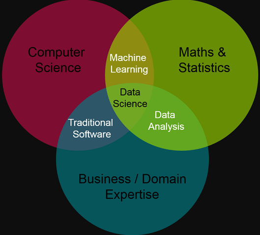
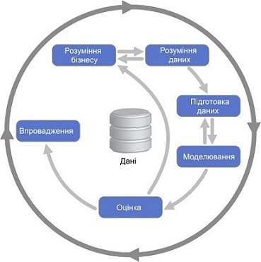
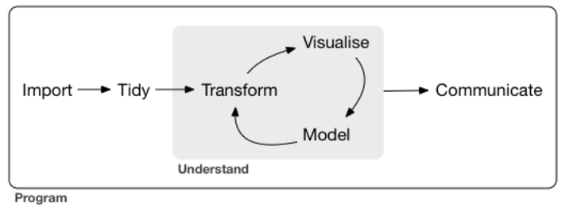

```{r setup, include=FALSE}
options(htmltools.dir.version = FALSE)
```

class: center, middle
# <span style="color:darkblue"> Що таке R і навіщо це айтівцю?

---

## <span style="color:darkblue"> R - спеціалізована мова програмування

[R](https://uk.wikipedia.org/wiki/R_(%D0%BC%D0%BE%D0%B2%D0%B0_%D0%BF%D1%80%D0%BE%D0%B3%D1%80%D0%B0%D0%BC%D1%83%D0%B2%D0%B0%D0%BD%D0%BD%D1%8F) - мова програмування і програмне середовище для статистичних обчислень, аналізу та візуалізації даних в графічному вигляді.  

Поширюється безкоштовно за ліцензією  _GNU General Public License_.

R поряд з мовою Python входить до топ-2 інструментів для:

* __Data Science__

* Data Analysis

* Machine Learning

---

## <span style="color:darkblue"> Що таке Data Science? 


__Data Science (наука про дані)__ -- розділ інформатики, що вивчає проблеми аналізу, обробки і представлення даних у цифровій формі. Об'єднує методи по обробці даних в умовах великих обсягів і високого рівня паралелізму, статистичні методи, методи інтелектуального аналізу даних і застосунки штучного інтелекту для роботи з даними, а також методи проектування і розробки баз даних (Вікіпедія).

Фахівець -- __Data Scientist__.

---

## <span style="color:darkblue">  Яким вимогам має відповідати Data Scientist?



---

## <span style="color:darkblue">  Що таке Data Science-проект?

Будь-який Data Science-проект (альтернативна назва -- Data Mining-проект) має на меті реалізацію на практиці методології [CRISP DM](https://www.the-modeling-agency.com/crisp-dm.pdf) [@CRISP_DM].


---

Якщо виділити з даного процесу суто технологічну складову, то типова технологічна основа будь-якого Data Science-проекту має виглядати наступним чином [@r4ds].  




---

## <span style="color:darkblue"> Два типи проектів з ІАД


* __Разове рішення__ - на виході приховані корисні для бізнесу знання. Товар - приховані знання

* __Тиражування знань експертів__ - на виході інформаційна технологія, що дозволяє отримувати прихованні корисні для бізнесу знання. Товар -- інформаційна технологія


---

class: center, middle

## <span style="color:darkblue"> Як реалізувати за допомогою R __перший тип__ проекту?


---

## <span style="color:darkblue"> Для реалізації першого типу проекта необхідно ...


* Скачати і встановити інтерпретатор [R](https://cran.r-project.org/)
* Скачати і встановити [IDE RStudio](https://posit.co/download/rstudio-desktop/)
* Реалізувати проект у концепції "грамотного програмування" за допомогою пакета [RMarkdown](https://rmarkdown.rstudio.com/) або наукової видавничої системи [Quarto](https://quarto.org/) від компанії [Posit](https://posit.co/) 
* відкомпілювати вихідний інтерактивний документу вигляді html-ноутбука, pdf, doc документа або презентації
* відправити замовнику


---

## <span style="color:darkblue"> Для реалізації другого типу проекта необхідно ...


* Скачати і встановити інтерпретатор [R](https://cran.r-project.org/)
* Скачати і встановити [IDE RStudio](https://posit.co/download/rstudio-desktop/)
* Реалізувати програмний застосунок з реактивним веб-інтерфейсом за допомогою фреймворка [Shiny](https://shiny.posit.co/) від компанії [Posit](https://posit.co/) 
* розгорнути застосунок одним з доступним способів: на локальному сервері або у хмарі (shinyapp.io, AWS тощо)


---

class: middle

### <span style="color:darkblue"> А тепер покажемо інструментарій проекта першого типу на практиці...


---

class: middle

### <span style="color:darkblue"> Доречі, ця презентація зроблена також e середовищі R-RStudio.


---

## <span style="color:darkblue"> Додаткові ресурси

### Загальні

* [kdnuggets](https://www.kdnuggets.com/)
* [Data Scince Central](https://www.datasciencecentral.com)

### R

* [The Comprehensive R Archive Network](https://cran.r-project.org/)
* [R-bloggers](https://www.r-bloggers.com/)
* [Bioconductor](https://www.bioconductor.org/)
* [Satistics with R](http://zoonek2.free.fr/UNIX/48_R/all.html)


---

class: middle

### <span style="color:darkblue"> Всі матеріали сьогоднішнього воркшопу за цим посиланням: https://github.com/VGamaley/demo-R.

---

class: middle

### <span style="color:darkblue"> Хочеш поглибити свої знання у цьому напрямку і навчитися розробляти Data Science-роекти? - Приходь [до нас](http://cee.kdu.edu.ua/) і на [мої курси](http://cee.kdu.edu.ua/uk/content/sydorenko-valeriy-mykolayovych).

---

class: center, middle

# <span style="color:darkblue"> Q & A


---
class: inverse, center, middle

# be continued..


